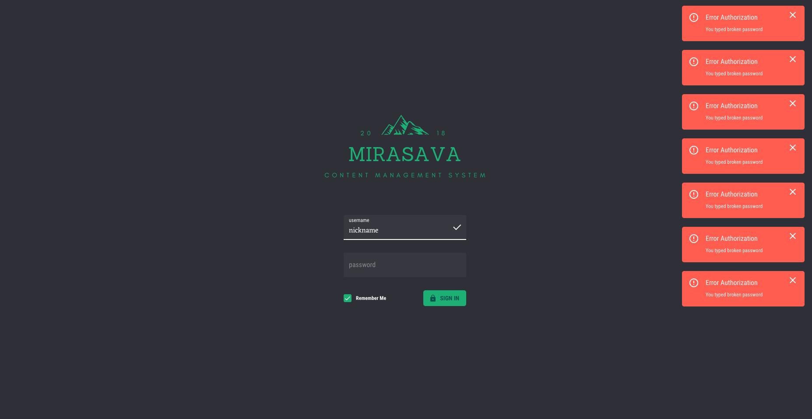

# 🧝‍ Mirasava - boilerplate for admin side React project.

Mirasava using the following technologies:

- React
- Redux
- Redux observable
- Ramda
- Rxjs 6
- Server Side Rendering
- Code splitting
- React Router 4
- Async imports
- Webpack 4
- PostCss
- Hot Module Replacement
- Babel
- Express
- Flow
- Mongoose
- Jest
- jsonWebToken
- webpack-dev-middleware
- webpack-hot-middleware
